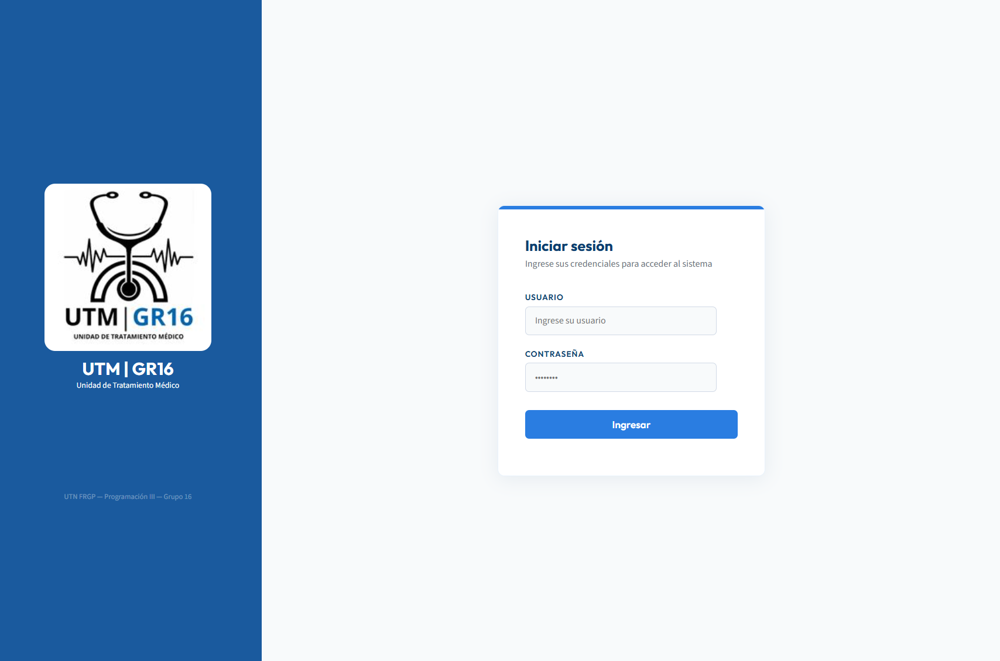
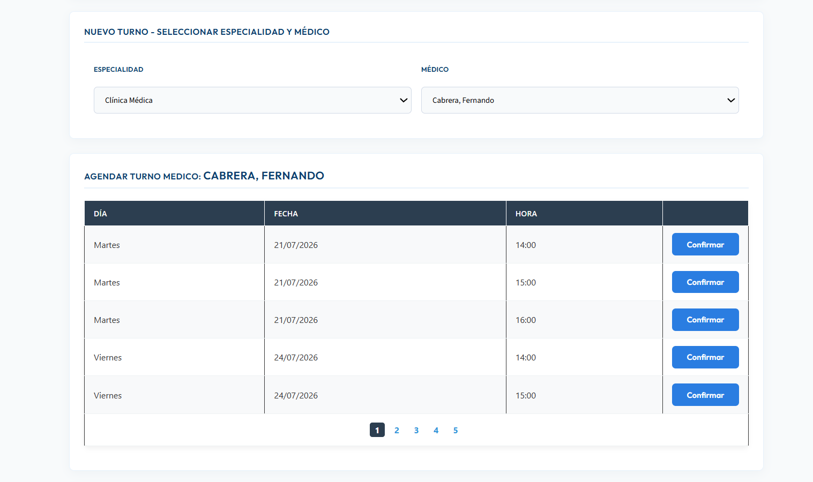
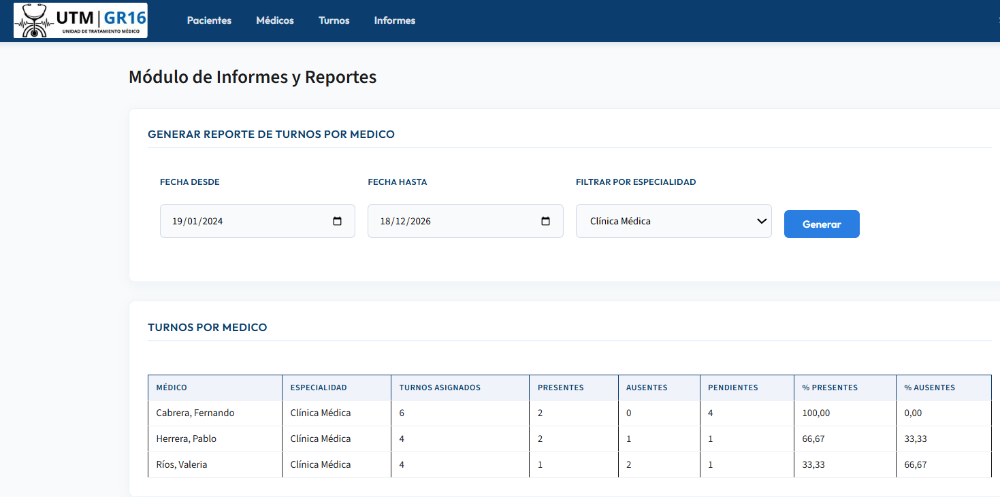

# 🏥 Medical Clinic Management System

**🌐 [English](#-english) · [Español](#-español)**

---

## 🇬🇧 English

A full-featured clinic management web application built with **C# / ASP.NET Web Forms** on a strict **three-layer architecture**, backed by **SQL Server** and **stored procedures only** (no ORM, no inline SQL).

> 🎓 Developed as the capstone project (*Trabajo Práctico Integrador*) for **Programación III** — Tecnicatura Universitaria en Programación, **UTN FRGP** (2026). Defended live and graded **10/10**.

### ✨ Features

**Administrator role**
- 🧑‍⚕️ Full CRUD for **patients** and **doctors** (logical deletes — no data is ever physically removed)
- 📅 **Appointment scheduling engine**: pick a specialty → doctor → available slot, with a 30-day agenda generated server-side (recursive CTE) that marks each slot as free/taken and prevents double-booking
- 📊 **Reports & statistics** (not just listings — aggregated data): attendance percentages by date range and specialty, patient attendance ranking, most-requested specialties
- 🔎 Paginated grids with `LIKE %text%` search plus independent filters (date ranges, specialty, status) that survive pagination

**Doctor role**
- 🗓️ Personal agenda with search and filters
- ✅ Marks patients as **present/absent** and attaches consultation notes
- 🔐 Own credentials, creatable and editable by the administrator (double password entry with `CompareValidator`)

**Cross-cutting**
- 🔑 Login with session control: every page shows the logged-in user, direct URL access redirects to login, role-based routing, no-cache headers so the browser's Back button can't leak authenticated pages
- 🧪 Three validation levels: client-side validators → `Page.IsValid` → `TryParse` in the business layer
- 💬 Confirmation dialogs and clear success/error messages on every operation

### 🏗️ Architecture

```
┌───────────────────────────────────────────────┐
│  PRESENTATION  (Vistas/)                      │
│  ASP.NET Web Forms · Master Pages · Validators│
└───────────────┬───────────────────────────────┘
                │  typed calls, no SQL here
┌───────────────▼───────────────────────────────┐
│  BUSINESS  (Negocio/)                         │
│  Type translation · business conventions      │
│  (e.g. "0 = all specialties", TryParse rules) │
└───────────────┬───────────────────────────────┘
                │  entities & primitives
┌───────────────▼───────────────────────────────┐
│  DATA ACCESS  (DAO/ + Entidades/)             │
│  ADO.NET · SqlCommand · stored procedures only│
│  Generic AccesoDatos wrapper (overloaded)     │
└───────────────┬───────────────────────────────┘
                │
        ┌───────▼────────┐
        │   SQL Server    │
        │  35+ stored     │
        │  procedures     │
        └────────────────┘
```

Design decisions worth highlighting:

- **`AccesoDatos` as a single connection gateway** — overloaded generic methods (`ObtenerTablaConSP`, `EjecutarProcedimientoAlmacenado`, `ObtenerEscalarConSP`) with `try/catch/finally` guaranteeing connection closure. Errors propagate upward as `null`/`-1` contracts instead of raw exceptions reaching the UI.
- **Optional filters resolved at the SP layer** — nullable `DateTime?` parameters travel as `DBNull.Value` and the procedure ignores them with `(@Param IS NULL OR ...)`, keeping a single procedure per report instead of one per filter combination.
- **`null` (C#) vs `DBNull.Value` (database)** handled explicitly across the ADO.NET boundary.
- **Reports are computed data**, not listings: percentages are calculated over *closed* appointments only, with division-by-zero guards.

### 🛠️ Tech Stack

| Layer | Technology |
|---|---|
| Frontend | ASP.NET Web Forms (.NET Framework 4.8), CSS |
| Backend | C#, three-layer architecture |
| Data access | ADO.NET (`SqlConnection`, `SqlCommand`, `SqlDataAdapter`) |
| Database | SQL Server (Express), T-SQL stored procedures, recursive CTEs |
| IDE / VCS | Visual Studio · Git · GitHub |

### 🚀 Getting Started

**Prerequisites**
- Visual Studio 2022 (with ASP.NET workload)
- SQL Server Express (instance `localhost\sqlexpress`, Windows Authentication)

**Database setup** — run the scripts **in order** (each is idempotent and re-runnable):

```
01- Script_Clinica.sql                → database, tables, constraints
02- Script_Administradores.sql        → admin users
03- Script_Pacientes.sql              → patients module objects
04- Script_ProcedimientosAlmacenados  → stored procedures
05- Script_DatosPrueba.sql            → test data (15+ rows per table)
06- Script_TurnosYObservaciones.sql   → appointments engine
```

**Run**
1. Open `TPINT_GRUPO_16_PR3.slnx` in Visual Studio
2. Rebuild the solution
3. Set `Login.aspx` as the start page and press **F5**

**Demo credentials**

| Role | User | Password |
|---|---|---|
| Administrator | `admin` | `admin123` |
| Doctor | `medico` | `medico123` |

*(Demo data only — see security note below.)*

### 📸 Screenshots

<!-- TODO: add screenshots



-->

### ⚠️ Known Limitations & Roadmap

This project followed an academic specification that fixed some constraints. Documented here deliberately — knowing *why* something is a limitation matters as much as the feature list:

- 🔐 **Passwords are stored in plain text** (per course scope). Roadmap: salted hashing (e.g. PBKDF2/bcrypt) at the business layer plus SP changes.
- ⚙️ Connection string is hardcoded to the local SQLEXPRESS instance with Windows Authentication (no credentials in the repo). Roadmap: move to `Web.config` `connectionStrings` with transformations per environment.
- 🎨 Some UI feedback colors are set from code-behind; migrating them to CSS classes is in progress.

### 👥 Team

Group project (5 members). My roles: **Reports & Statistics module** (`Informes`), **code review and project integration** — cross-module bug fixing, CSS, test-data scripts, and SQL script consolidation.

### 📄 License

[MIT](LICENSE)

---
---

## 🇦🇷 Español

Aplicación web completa de gestión para una clínica médica, desarrollada en **C# / ASP.NET Web Forms** con **arquitectura estricta en tres capas**, sobre **SQL Server** y **exclusivamente stored procedures** (sin ORM, sin SQL embebido).

> 🎓 Desarrollada como proyecto integrador (*Trabajo Práctico Integrador*) de **Programación III** — Tecnicatura Universitaria en Programación, **UTN FRGP** (2026). Defendida en vivo y calificada con **10/10**.

### ✨ Funcionalidades

**Rol Administrador**
- 🧑‍⚕️ ABML completo de **pacientes** y **médicos** (bajas lógicas — ningún dato se elimina físicamente)
- 📅 **Motor de turnos**: se elige especialidad → médico → franja disponible, con una agenda de 30 días generada del lado del servidor (CTE recursiva) que marca cada franja como libre/ocupada e impide la doble reserva
- 📊 **Informes y estadísticas** (no listados — información procesada): porcentajes de asistencia por rango de fechas y especialidad, ranking de asistencia de pacientes, especialidades más solicitadas
- 🔎 Grillas paginadas con búsqueda `LIKE %texto%` y filtros independientes (rangos de fechas, especialidad, estado) que se mantienen al cambiar de página

**Rol Médico**
- 🗓️ Agenda propia con búsquedas y filtros
- ✅ Carga de **presentes/ausentes** con observaciones de la consulta
- 🔐 Credenciales propias, creadas y modificables por el administrador (contraseña con doble ingreso y `CompareValidator`)

**Transversal**
- 🔑 Login con control de sesión: todas las páginas muestran el usuario logueado, el acceso por URL directa redirige al login, ruteo por rol y headers no-cache para que el botón "Atrás" no exponga páginas autenticadas
- 🧪 Tres niveles de validación: validadores del lado del cliente → `Page.IsValid` → `TryParse` en la capa de negocio
- 💬 Diálogos de confirmación y mensajes claros de éxito/error en cada operación

### 🏗️ Arquitectura

```
┌───────────────────────────────────────────────┐
│  PRESENTACIÓN  (Vistas/)                      │
│  ASP.NET Web Forms · Master Pages · Validators│
└───────────────┬───────────────────────────────┘
                │  llamadas tipadas, sin SQL acá
┌───────────────▼───────────────────────────────┐
│  NEGOCIO  (Negocio/)                          │
│  Traducción de tipos · convenciones de negocio│
│  (ej. "0 = todas las especialidades")         │
└───────────────┬───────────────────────────────┘
                │  entidades y primitivos
┌───────────────▼───────────────────────────────┐
│  ACCESO A DATOS  (DAO/ + Entidades/)          │
│  ADO.NET · SqlCommand · solo stored procedures│
│  Wrapper genérico AccesoDatos (sobrecargado)  │
└───────────────┬───────────────────────────────┘
                │
        ┌───────▼────────┐
        │   SQL Server    │
        │  35+ stored     │
        │  procedures     │
        └────────────────┘
```

Decisiones de diseño destacables:

- **`AccesoDatos` como puerta única de conexión** — métodos genéricos sobrecargados (`ObtenerTablaConSP`, `EjecutarProcedimientoAlmacenado`, `ObtenerEscalarConSP`) con `try/catch/finally` que garantiza el cierre de la conexión. Los errores se propagan hacia arriba como contratos `null`/`-1` en lugar de excepciones crudas llegando a la UI.
- **Filtros opcionales resueltos en la capa de SP** — los parámetros `DateTime?` viajan como `DBNull.Value` y el procedimiento los ignora con `(@Param IS NULL OR ...)`, manteniendo un único procedimiento por informe en lugar de uno por combinación de filtros.
- **`null` (C#) vs `DBNull.Value` (base de datos)** manejados explícitamente a través de la frontera de ADO.NET.
- **Los informes son información procesada**, no listados: los porcentajes se calculan sobre turnos *cerrados* únicamente, con protección contra división por cero.

### 🛠️ Stack Tecnológico

| Capa | Tecnología |
|---|---|
| Frontend | ASP.NET Web Forms (.NET Framework 4.8), CSS |
| Backend | C#, arquitectura en tres capas |
| Acceso a datos | ADO.NET (`SqlConnection`, `SqlCommand`, `SqlDataAdapter`) |
| Base de datos | SQL Server (Express), stored procedures T-SQL, CTEs recursivas |
| IDE / VCS | Visual Studio · Git · GitHub |

### 🚀 Puesta en Marcha

**Requisitos previos**
- Visual Studio 2022 (con la carga de trabajo de ASP.NET)
- SQL Server Express (instancia `localhost\sqlexpress`, Autenticación de Windows)

**Configuración de la base** — ejecutar los scripts **en orden** (cada uno es idempotente y re-ejecutable):

```
01- Script_Clinica.sql                → base, tablas, constraints
02- Script_Administradores.sql        → usuarios administradores
03- Script_Pacientes.sql              → objetos del módulo pacientes
04- Script_ProcedimientosAlmacenados  → stored procedures
05- Script_DatosPrueba.sql            → datos de prueba (15+ filas por tabla)
06- Script_TurnosYObservaciones.sql   → motor de turnos
```

**Ejecución**
1. Abrir `TPINT_GRUPO_16_PR3.slnx` en Visual Studio
2. Recompilar la solución
3. Establecer `Login.aspx` como página de inicio y presionar **F5**

**Credenciales de demo**

| Rol | Usuario | Contraseña |
|---|---|---|
| Administrador | `admin` | `admin123` |
| Médico | `medico` | `medico123` |

*(Datos de demostración — ver nota de seguridad más abajo.)*

### 📸 Capturas de Pantalla

<!-- TODO: agregar capturas


-->

### ⚠️ Limitaciones Conocidas y Roadmap

Este proyecto siguió una consigna académica que fijó ciertas restricciones. Se documentan acá deliberadamente — saber *por qué* algo es una limitación importa tanto como la lista de funcionalidades:

- 🔐 **Las contraseñas se almacenan en texto plano** (alcance de la cursada). Roadmap: hashing con salt (ej. PBKDF2/bcrypt) en la capa de negocio más los cambios en los SP.
- ⚙️ La cadena de conexión está hardcodeada a la instancia local SQLEXPRESS con Autenticación de Windows (no hay credenciales en el repo). Roadmap: moverla a `connectionStrings` en `Web.config` con transformaciones por entorno.
- 🎨 Algunos colores de feedback de la UI se setean desde code-behind; la migración a clases CSS está en curso.

### 👥 Equipo

Proyecto grupal (5 integrantes). Mis roles: **módulo de Informes y Estadísticas**, **revisión de código e integración del proyecto** — corrección de bugs entre módulos, CSS, scripts de datos de prueba y consolidación de scripts SQL.

### 📄 Licencia

[MIT](LICENSE)